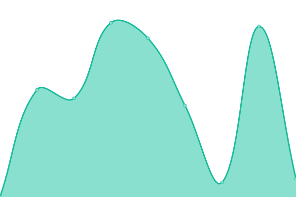

# [📈 Live Status](https://yaacov9.github.io/upptime): <!--live status--> **🟧 Partial outage**

This repository contains the open-source uptime monitor and status page for [yaacov9](http://elbazyaacov.com/), powered by [Upptime](https://github.com/upptime/upptime).

With [Upptime](https://upptime.js.org), you can get your own unlimited and free uptime monitor and status page, powered entirely by a GitHub repository. We use [Issues](https://github.com/yaacov9/upptime/issues) as incident reports, [Actions](https://github.com/yaacov9/upptime/actions) as uptime monitors, and [Pages](https://yaacov9.github.io/upptime) for the status page.

<!--start: status pages-->
<!-- This summary is generated by Upptime (https://github.com/upptime/upptime) -->
<!-- Do not edit this manually, your changes will be overwritten -->
<!-- prettier-ignore -->
| URL | Status | History | Response Time | Uptime |
| --- | ------ | ------- | ------------- | ------ |
|  [Google](https://www.google.com) | 🟩 Up | [google.yml](https://github.com/yaacov9/upptime/commits/HEAD/history/google.yml) | 

 109ms
     
 | 

<a href="https://yaacov9.github.io/upptime/history/google">100.00%</a>
    

|  [HomeAssistant](https://homeassistant.maav.duckdns.org) | 🟩 Up | [home-assistant.yml](https://github.com/yaacov9/upptime/commits/HEAD/history/home-assistant.yml) | 

 2953ms
     
 | 

<a href="https://yaacov9.github.io/upptime/history/home-assistant">100.00%</a>
    

|  [SWAG](https://maav.duckdns.org) | 🟥 Down | [swag.yml](https://github.com/yaacov9/upptime/commits/HEAD/history/swag.yml) | 

 0ms
     
 | 

<a href="https://yaacov9.github.io/upptime/history/swag">0.00%</a>
    

|  [PocketBase Maison](https://pkbase.maav.duckdns.org) | 🟥 Down | [pocket-base-maison.yml](https://github.com/yaacov9/upptime/commits/HEAD/history/pocket-base-maison.yml) | 

 2439ms
     
 | 

<a href="https://yaacov9.github.io/upptime/history/pocket-base-maison">0.00%</a>
    

|  [HomeAssistant Maison](https://HomeAssistant.maav.duckdns.org) | 🟩 Up | [home-assistant-maison.yml](https://github.com/yaacov9/upptime/commits/HEAD/history/home-assistant-maison.yml) | 

 196ms
     
 | 

<a href="https://yaacov9.github.io/upptime/history/home-assistant-maison">100.00%</a>
    

|  [Plex Maison](https://Plex.maav.duckdns.org) | 🟥 Down | [plex-maison.yml](https://github.com/yaacov9/upptime/commits/HEAD/history/plex-maison.yml) | 

 1739ms
     
 | 

<a href="https://yaacov9.github.io/upptime/history/plex-maison">0.00%</a>
    

|  [Anaelle Birthday](https://AnaelleBirthday.com) | 🟩 Up | [anaelle-birthday.yml](https://github.com/yaacov9/upptime/commits/HEAD/history/anaelle-birthday.yml) | 

 278ms
     
 | 

<a href="https://yaacov9.github.io/upptime/history/anaelle-birthday">100.00%</a>
    

|  [Deelim - Site](https://deelim.com) | 🟥 Down | [deelim-site.yml](https://github.com/yaacov9/upptime/commits/HEAD/history/deelim-site.yml) | 

 844ms
     
 | 

<a href="https://yaacov9.github.io/upptime/history/deelim-site">99.99%</a>
    

|  [Deelim - API](https://api.deelim.com) | 🟩 Up | [deelim-api.yml](https://github.com/yaacov9/upptime/commits/HEAD/history/deelim-api.yml) | 

 724ms
     
 | 

<a href="https://yaacov9.github.io/upptime/history/deelim-api">100.00%</a>
    

|  [Deelim - API (TEST)](https://api.test.deelim.com) | 🟩 Up | [deelim-api-test.yml](https://github.com/yaacov9/upptime/commits/HEAD/history/deelim-api-test.yml) | 

 588ms
     
 | 

<a href="https://yaacov9.github.io/upptime/history/deelim-api-test">99.56%</a>
    

<!--end: status pages-->

[**Visit our status website →**](https://yaacov9.github.io/upptime)

## 📄 License

- Powered by: [Upptime](https://github.com/upptime/upptime)
- Code: [MIT](./LICENSE) © [Anand Chowdhary](https://anandchowdhary.com), supported by [Pabio](https://pabio.com)
- Data in the `./history` directory: [Open Database License](https://opendatacommons.org/licenses/odbl/1-0/)
